基于ssm的仓库管理系统，用shiro做的权限控制

源码下载：http://www.manoncode.cn/details?id=26

CSDN博客地址：https://blog.csdn.net/mataodehtml/article/details/112321163

B站运行视频：https://www.bilibili.com/video/BV1NK4y1T7Vk/

开发环境：eclipse/idea + maven + mysql + tomcat(版本不限)

技术框架：ssm+shiro+bootstrap+jquery+jsp等

本项目功能分成二个模块：

	超级管理员：有库存管理（库存查询，出入库记录查询），出入库管理（货物入库，货物出库），
人员管理（仓库管理员管理），基础数据（供应商信息管理，客户信息管理，货物信息管理，仓库信息管理），
系统维护（修改密码，系统日志，登陆日志）等菜单

普通管理员：有库存管理（库存查询），出入库管理（货物入库，货物出库），系统维护（更改密码）

登陆：
1001   123456（超级管理员）

其他账号为普通管理员

新添加的管理员账号默认为登陆id

超级管理员：

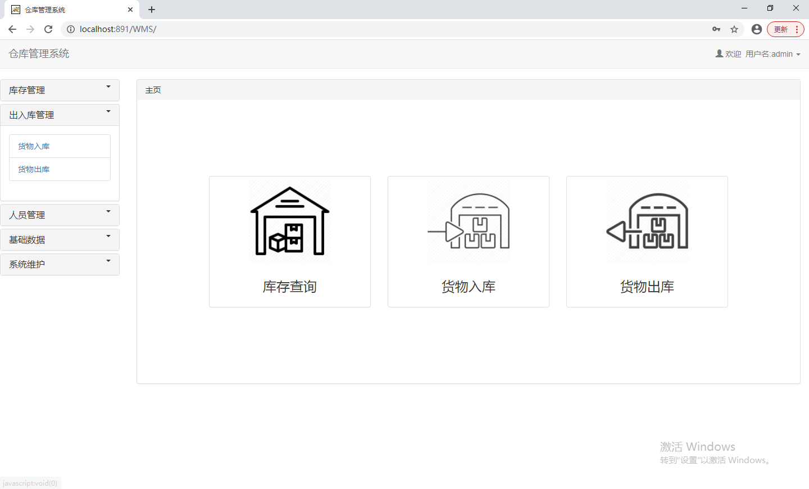

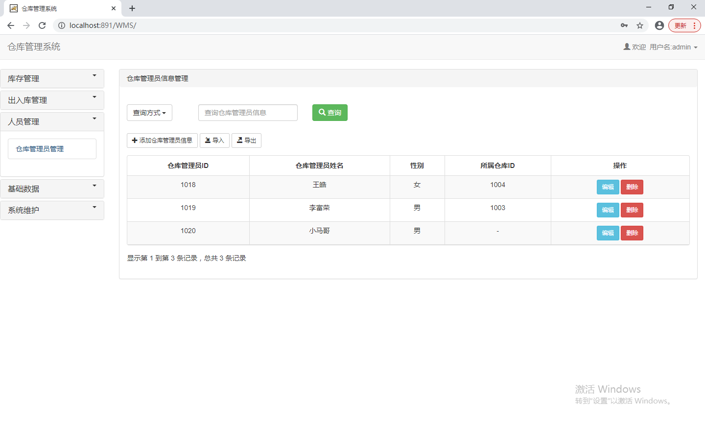

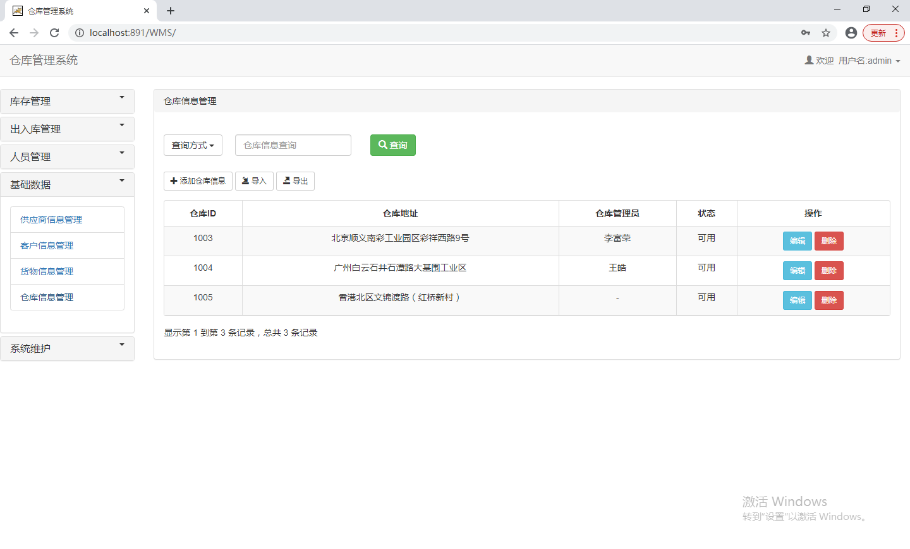

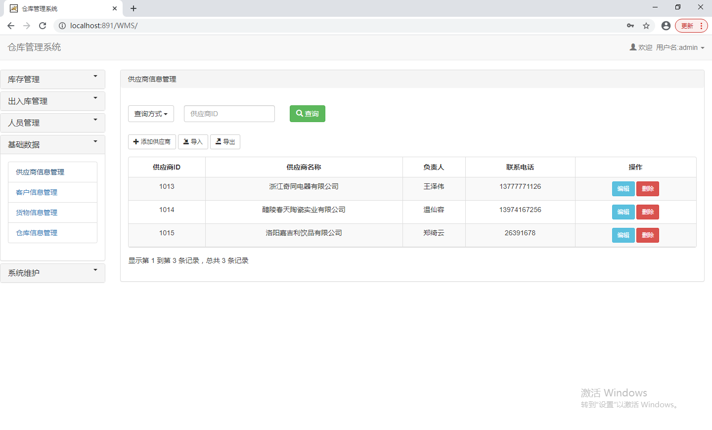

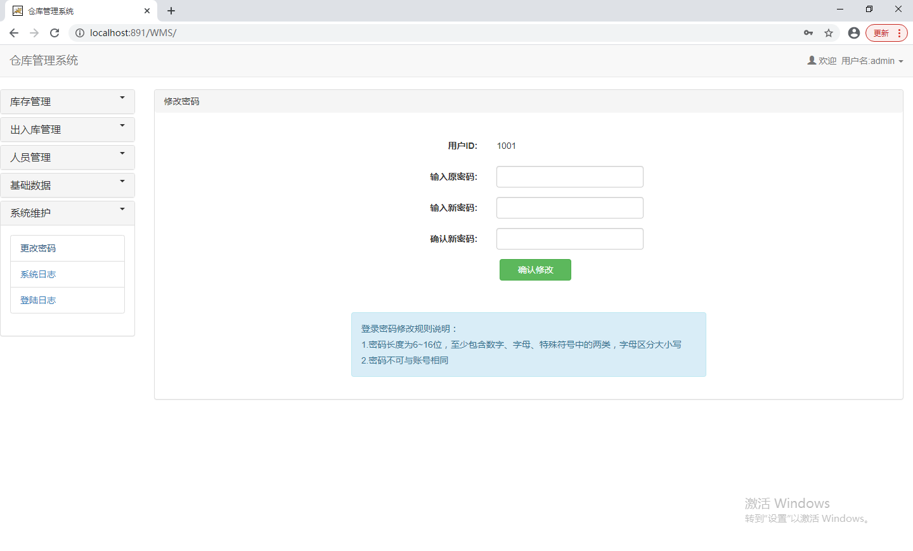

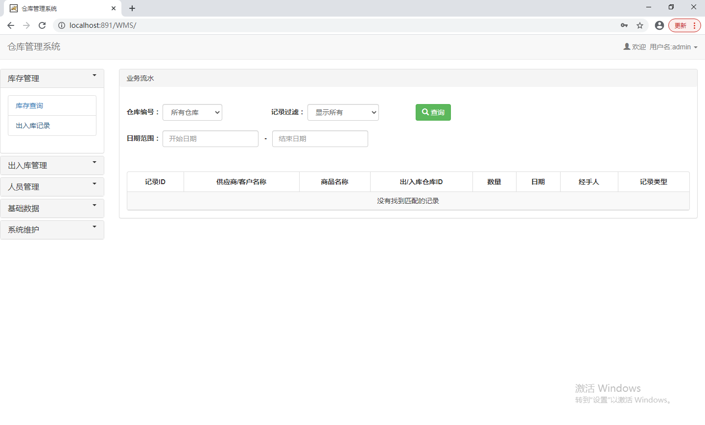

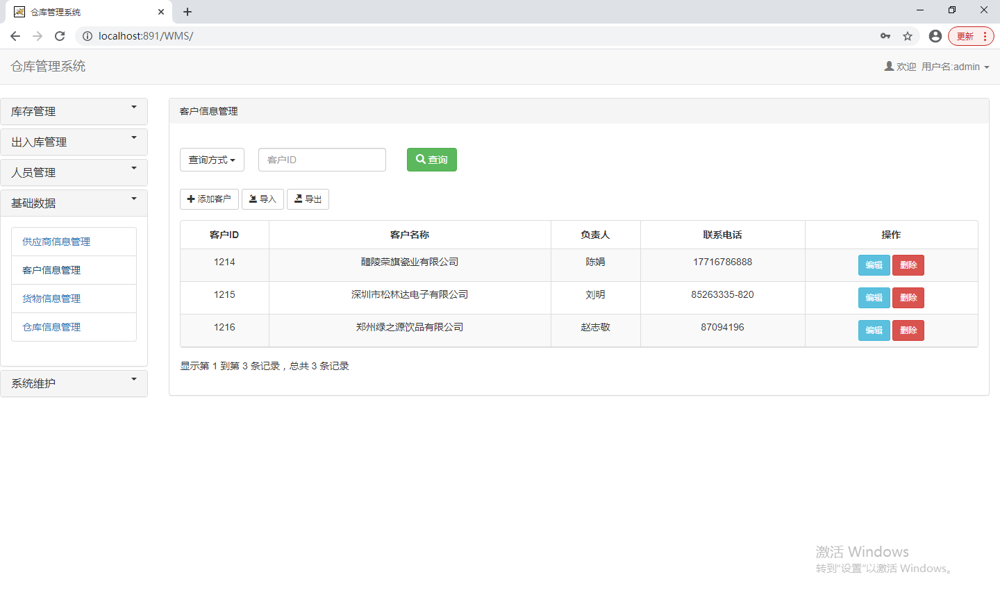

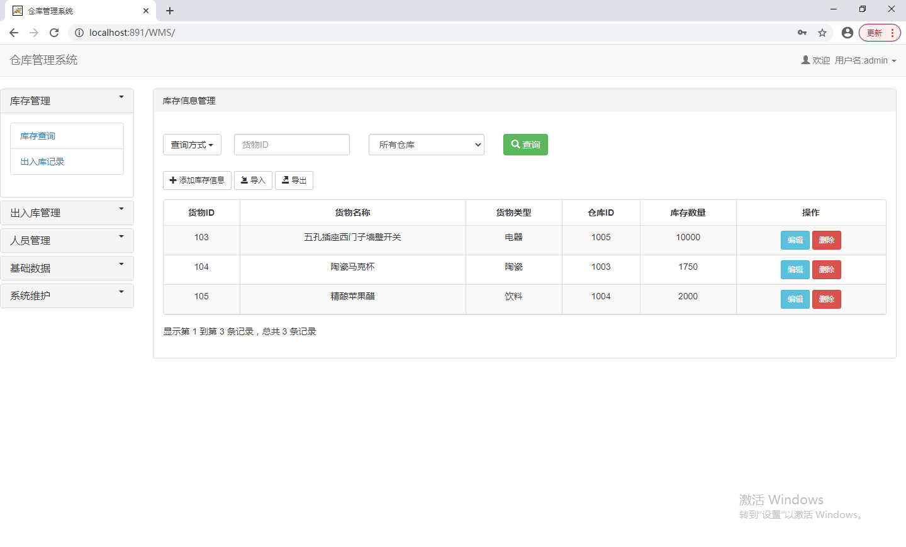

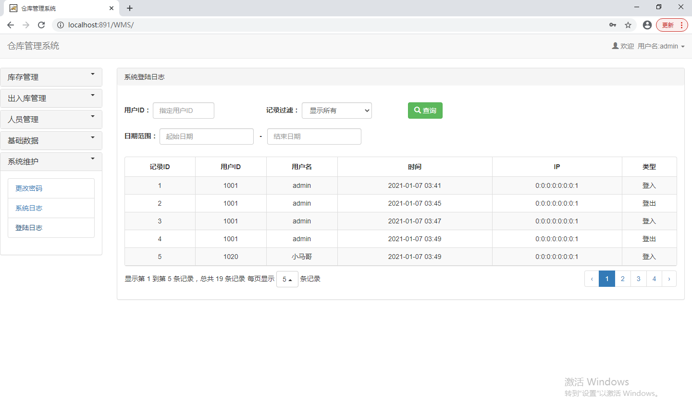

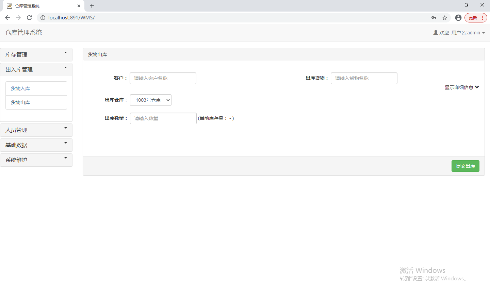

普通管理员：

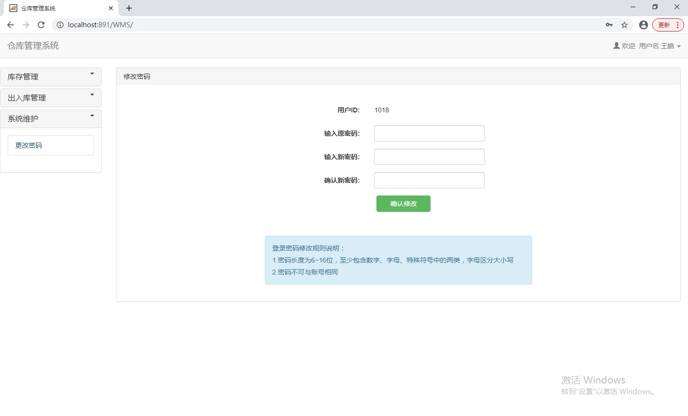

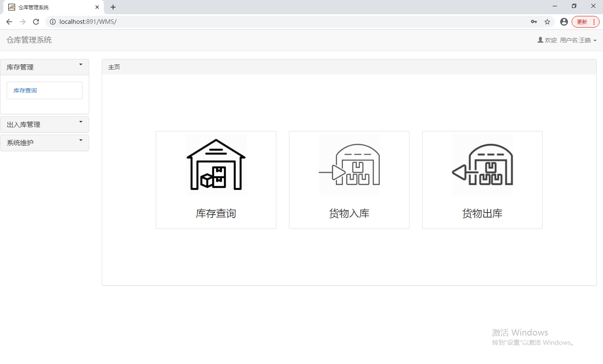

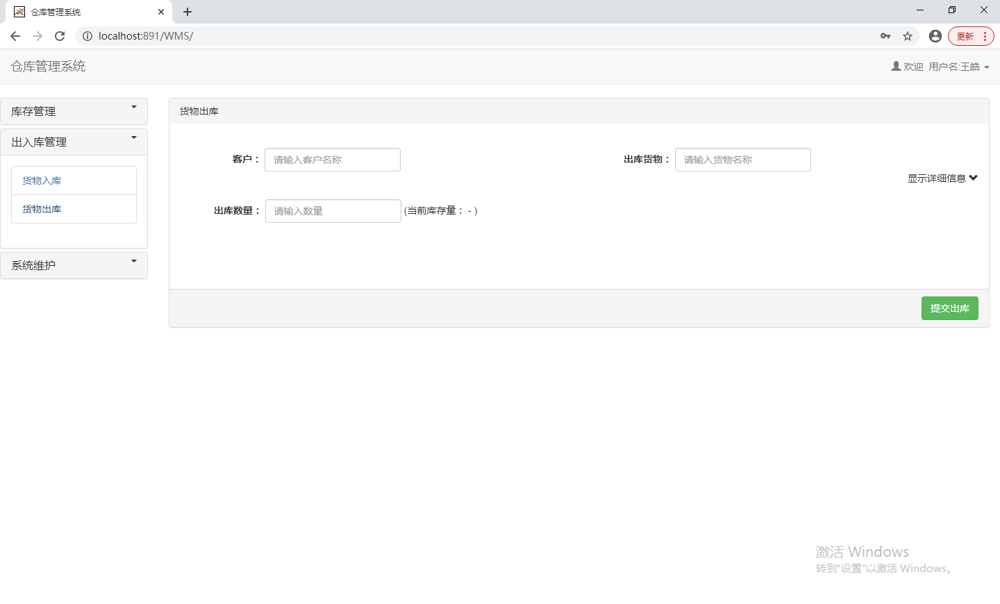

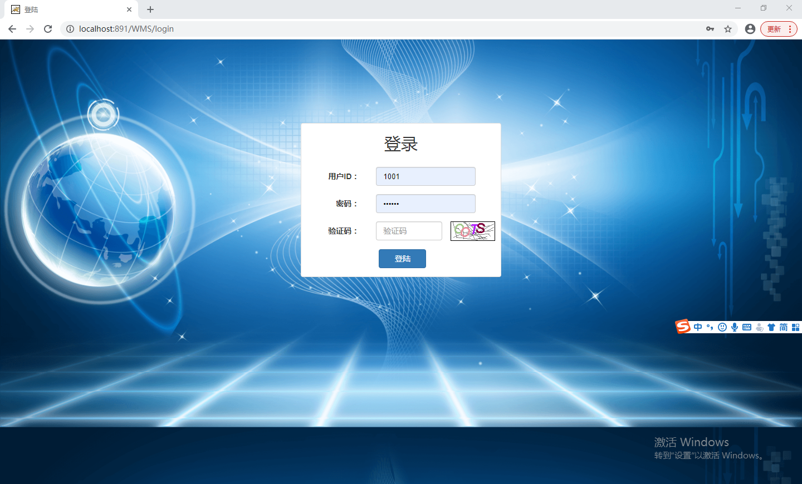
